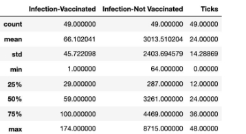
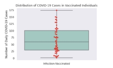
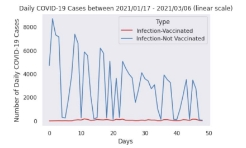
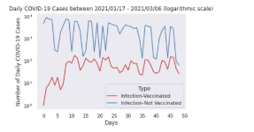
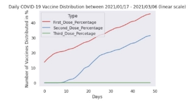
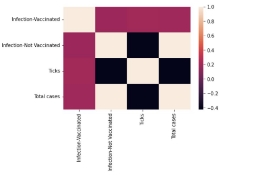
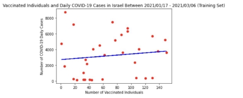
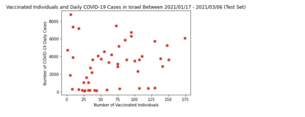
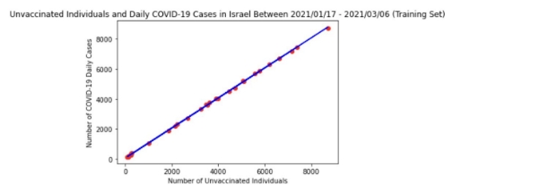
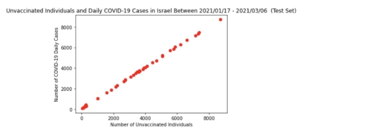

**Efficacy of COVID-19 Vaccines in Israel**

**Group 5**

Kaushik Thakkar (1007568945) Kristine Antony  (1000434005) Mohamad El Ghazal  (1003799892) Noah Brex  (1008624277)

Nofel Wasey (1001622345) Sheldon Chen (1002988797 ) Tashi Lhamo  (999455842)

INF1344 - University of Toronto Dec 12, 2021

**Summary**

Effective vaccines are needed to help stop the spread of the COVID-19 virus and restore order around the world. COVID-19 has significantly impacted countries around the world in the areas of healthcare systems, economies, and society. However, due to the emergence of new COVID-19 variants of concern, there is discussion and research being developed on vaccine efficacy against infection, severity, and transmission.

This paper investigates the effectiveness of vaccines against COVID-19 in Israel, a nation widely known to have had early access and a significant uptake. As case counts fluctuated, governments around the world were pleading with their citizens to get vaccinated to help stop the spread. Due to a minor portion of the population being vaccine hesitant, infection rates between the populations were examined. The null hypothesis was to assume that vaccinated individuals (two weeks after second dose) would have similar case counts confirmed via PCR testing as the unvaccinated. A hypothesis test was conducted utilizing python to analyze the data and compare the vaccinated and unvaccinated groups. The analysis shows that there is a significant reduction in COVID-19 cases among individuals that have been fully vaccinated. On this basis, it can be concluded that vaccines are effective in preventing transmissibility of COVID-19 among vaccinated individuals and that the main source of spread are individuals who remain unvaccinated. The study controlled for variants of concern by isolating a time frame where the COVID-19 alpha strain was dominant and vaccines were available.

**Introduction & Background**

The COVID-19 pandemic is a global health emergency with devastating impact on the socioeconomic systems across the globe amidst public health systems struggling to contain the spread of the virus (Verma et al., 2021). Since the emergence of SARS-CoV-2, the virus responsible for causing COVID-19, the World Health Organization (2021) has recorded a global death toll of 5,195,354 and 260,493,573 cases as of November 28, 2021. With the SARS-CoV-2 virus continually

evolving, vaccine efficacy studies are integral to developing effective strategies to curb the spread of COVID-19 and help nations contain and adapt to the changing terrain of the evolving disease. ‘Variants of Concern (VOC)’ of the SARS-CoV-2 virus including the alpha variant and newly emerging variants are routinely monitored for infection risks, transmissibility and disease severity along with vaccine performance against these variants of concern in terms of reducing infection rates, symptomatic diseases and severity of the disease (WHO, 2021). Vaccine efficacy is explored using a wide array of metrics termed as efficacy endpoints such as its performance against infections, disease and disease severity, transmission (Hodgson et. al, 2021).

Along with public health measures and mass scale vaccination efforts to curb the spread of COVID-19, there is an imperative to demonstrate the effectiveness of COVID-19 vaccines with transparency to better persuade and assuage those who are vaccine hesitant. Nations such as Israel have been relatively successful in their vaccination efforts. However, cases of vaccine hesitancy and vaccine rejection persist among select demographics including younger people (Gurwitz, 2021), with vaccine hesitancy among the general Israeli population including health care professionals citing concerns around vaccine safety due to its short development period, the potential side effects and COVID-19 illness (Dror et.al, 2020). Transparency around vaccine effectiveness in terms of incidence of infection amongst vaccinated relative to unvaccinated are crucial in demystifying and transforming public perception and concerns around vaccines. In order to better persuade those who are vaccine hesitant with real world proof of vaccine efficacy against COVID-19, this retrospective study will employ Israel as a case study to investigate the real world efficacy of vaccines against COVID-19 by hypothesis testing how the proportion of vaccinated individuals with covid cases compare to the proportion of unvaccinated individuals with covid cases from January 17 to March 6, 2021. The study looks at the difference between polymerase chain reaction (PCR) confirmed SARS-CoV-2  infections among vaccinated and unvaccinated as a metric or efficacy endpoint to draw conclusions about the effectiveness of a vaccine and vaccination against COVID-19. For a more comprehensive vaccination strategy, vaccine efficacy studies such as this will better inform the wider public and help rebuild public confidence in the vaccines. The datasets for this study were obtained from Israel's Ministry of Health Department.

**Methods**

This study conducts hypothesis testing involving two population proportions, vaccinated and unvaccinated individuals infected with COVID-19, in python to investigate the real world efficacy of vaccines against COVID-19 in Israel.

**Data collection method:**

- Our time frame  of analyses: January 17 to March, 2021. The timeframe was chosen based on the COVID variant of concern dominant at that time in Israel which was the Alpha variant.
- To control for the difference in vaccine effectiveness against different COVID-19 variants, the time frame allows us to isolate the infection rates for just the Alpha variant.
- Fully vaccinated individuals within this study are defined as  those with both the first and second dose of covid vaccines as triple vaccination with booster shots had yet to be introduced at the time.
- For the purposes of the study, a fully vaccinated individual is defined as those with first and second dose of COVID-19 vaccine as booster shots were yet to be introduced in Israel within the select time frame of study.

The data analyzed consists of daily COVID-19 cases between the desired time frame for vaccinated and unvaccinated individuals, daily vaccination update based on dose type and daily COVID-19 tests done in Israel. Israel's Ministry of Health department keeps a dashboard for daily COVID-19 information. Our team was able to download a CSV file containing the variables we required for this study.

**Data cleaning:** Before initiating any statistical tests, the raw data was cleaned in line with Dr. Hadley Wickham’s tidy data principles. Initially, columns containing parameters of interest were kept in appropriate dataframes, while unnecessary parameters were dropped. The dataset was filtered for our analysis time frame, January 17 to March 6, 2021.  Next, in order to make the data visualization process easier, we used the pandas melt function to make the wide dataset long. Detailed steps can be found in the Python file with annotated notes.

**Hypothesis test for two population proportions:** The hypothesis test compares Israel’s proportion of vaccinated individuals with SARS-CoV-2 infection relative to the proportion of unvaccinated individuals with the virus from January 17 to March 6, 2021 using 0.05 significance level.

Our null hypothesis **H** is that the proportion of vaccinated individuals with PCR confirmed

**0**

SARS-CoV-2 infection is equal to  the proportion of unvaccinated individuals with PCR confirmed SARS-CoV-2 infection. The alternative hypothesis **H1**is that the proportion of vaccinated individuals with PCR confirmed SARS-CoV-2 infection is less than the proportion of unvaccinated individuals with PCR confirmed SARS-CoV-2 infection indicating the vaccine is effective against COVID-19.

**H** : P = P **H** :  P < P

**0** 1 2 **1** 1 2

We use the total number of PCR tests taken each day to deduce the total population at risk of COVID infection, ie “n”. We assume that the population at risk of COVID infection (those who take COVID tests) have a similar attitude towards vaccines as the general public. As such, the vaccinated portion of the population at risk of COVID infection could be calculated by multiplying the total PCR tests with the general percentage of vaccination in Israel.

**Data visualization:** Box plots will be created using the same libraries to examine the distribution of data between the two samples, vaccinated and unvaccinated. A table was generated to describe the boxplot using the pandas describe function. Next, the daily COVID-19 cases over time between the January 17 - March 6, 2021 time period will be visualized. A linear and logarithmic scale for this line plot.

Afterwards, we will analyze the trend in vaccination uptake in Israel for the same time period. A line graph for vaccination doses will be created to show the growth rate of vaccine adoptions for the same time period. To better understand correlations between different variables affecting COVID-19 cases, a heatmap will be created using the Seaborn library. The heatmap will help to further examine the correlation between infection rates of both sample types, total case count and days passed. Finally, two linear regression models will be created using Scikit-learn. These were created for the intent of examining more closely the correlation between (1) COVID-19 cases daily & daily COVID-19 cases in vaccinated individuals and (2) COVID-19 cases daily & daily COVID-19 cases in unvaccinated individuals. Comparing the data to training sets also allowed for a more nuanced interpretation. For each linear regression model, a model score, p-value, equation of the line and standard error will be obtained. This will help us determine if we have a viable model and if we can make any inferences when comparing the two populations, vaccinated and unvaccinated.

**Results**

Using python, the values x1 ,x2and n1,n2 neccessary for calculating the two population proportions (P1 and P ) were first tabulated before initiating the hypothesis test as shown in Table 1. P and P

2 1 2 represent the proportion of vaccinated and unvaccinated populations with PCR confirmed

SARS-CoV-2 infection. The  two population groups  with PCR confirmed SARS-CoV-2 infection (x) are denoted by the average daily covid cases for vaccinated and unvaccinated populations, that is x1 = 66.102041 and x = 3013.510204 respectively. The sample sizes (n) are denoted by the population at

2

risk by vaccination status, that is n = 9969.700799 and n = 58715.319609 respectively.

1 2

**Table 1. COVID-19 Cases in Israel between January 17 - March 2021 Relative to Population**

**Table 1:** This figure shows COVID-19 cases in individuals who live in Israel who have and have not received the COVID-19 vaccine. Data Source: [Israel Ministry of Health](https://datadashboard.health.gov.il/COVID-19/general?utm_source=go.gov.il&utm_medium=referral.)

The two population proportions hypothesis test resulted in a z test statistic of -19.94 and p-value of 9.57e-89 as shown in Table 2. The p-value is less than our chosen level of significance,α = 0.05, as well as when level of significance a = 0.01 is used. As such, we reject the null hypothesis that the proportion of vaccinated individuals with PCR confirmed SARS-CoV-2 infection is equal to  the proportion of unvaccinated individuals with PCR confirmed SARS-CoV-2 infection. There is very strong evidence against the null hypothesis with level of significance a = 0.01. The sample evidence suggests very strongly that fully vaccinated populations have lower chances of being infected than the not fully vaccinated population.

**Table 2: Hypothesis Test for Two Sample Proportions**

|**Test Statistic (Z):**|**-19.937797368034737**|
| - | - |
|**P-Value**|**9.565238219571445e-89**|
**Table 2:** The Z test statistic and p-value were calculated for P1 (vaccinated sample) and P2 (unvaccinated sample). x1 = 66.102041, x2 = 3013.510204, n1= 9969.700799, n2 =58715.319609, Ho: p1 = p2, Ha: p1 < p2. Data Source: [Israel Ministry of Health](https://datadashboard.health.gov.il/COVID-19/general?utm_source=go.gov.il&utm_medium=referral.)

In addition to the two population proportion hypothesis test, the central tendency and distribution calculated in python for infection amongst vaccinated and unvaccinated populations in Israel from January 17 to March 2021 which resulted in daily mean of 66.10 infections among vaccinated group in contrast to the much higher mean of 3013.51 infections among the unvaccinated group. The standard deviation for the infections among the unvaccinated population is also much higher compared to the sample standard deviation for infections amongst the vaccinated group. Using visualization methods in python, the figure 1 and table 3 demonstrate that the central tendency for infection rates for the unvaccinated proportion of the population were wider than that of the vaccinated portion. The box plot in figure 1 shows a clear difference in rates between the vaccinated and unvaccinated populations. The vaccinated population range of the infection rates was much lower than those shown in the unvaccinated population, which had a more distributed infection rate.

**Table 3. Central Tendency and Distribution for COVID-19 Cases in Israel for Vaccinated and Unvaccinated Individuals**

**Table 3:** This table summarizes the central tendency and distribution of COVID-19 cases in vaccinated and unvaccinated individuals. Figure 1 shows the box plots based on this data. Data Source: [Israel Ministry of Health](https://datadashboard.health.gov.il/COVID-19/general?utm_source=go.gov.il&utm_medium=referral.)

**Figure 1: Distribution of COVID-19 Cases in Vaccinated and Unvaccinated Individuals in Israel between January 17 - March 6 2021 **

**Figure 1:** This box plot shows the distribution of daily COVID-19 cases in vaccinated and unvaccinated individuals in Israel between January 17 - March 6, 2021. The data is based on the calculations in Table 3. Data Source: [Israel Ministry of Health](https://datadashboard.health.gov.il/COVID-19/general?utm_source=go.gov.il&utm_medium=referral.)

In figure 2 looking at the logarithmic scale it is noted that vaccinated rates of infection were always lower than unvaccinated rates of infection. There was a spike in infection rates in the vaccinated population within the first 10 days of the data, but it levelled out and never reached the rates seen by the unvaccinated population. When looking at the linear progression model in figure 5 it is noticeable that case counts for vaccinated individuals remained consistently low. While the rate of infection for unvaccinated individuals decreased over the data period, it never reached the same consistency and lows that the vaccinated population displayed, as shown in figure 6.

**Figure 2: Daily COVID-19 Cases in Israel for Vaccinated and Unvaccinated Individuals between January 17 - March 2021**

**Figure 2:** This line plot shows daily COVID-19 cases in vaccinated and unvaccinated individuals in Israel between January 17 - March 6, 2021. The first graph is based on a linear scale, while the second graph uses a logarithmic scale.  Data Source: [Israel Ministry of Health](https://datadashboard.health.gov.il/COVID-19/general?utm_source=go.gov.il&utm_medium=referral.)

**Figure 3: Daily COVID-19 Vaccine Distribution in Israel between between January 17 - March 2021**

**Figure 3:** This line plot shows daily COVID-19 vaccinations (as %) in individuals in Israel between January 17 - March 6, 2021. First dose, second dose and third dose percentages were taken into account. Third doses were not available during the January 17 - March 6, 2021 period. Data Source: [Israel Ministry of Health](https://datadashboard.health.gov.il/COVID-19/general?utm_source=go.gov.il&utm_medium=referral.)

Based on figure 3, we can see that the general trend for vaccine adoptions was linear, with the introduction of the second dose following the same trend as the first dose.

Figure 4 shows the relationship between different variables in the daily COVID-19 cases dataset. It is noticeable that the correlation between unvaccinated infections and total cases (~1.0), is much higher than the correlation between vaccinated infections and total cases (~0.0).

**Figure 4: Heat Map for COVID-19 Cases in Israel for Vaccinated and Unvaccinated Individuals between January 17 - March 6 2021**

**Figure 4:** Heat map to identify any relationships between different variables (vaccinated individuals, unvaccinated individuals, Day (ticks), and total cases).

Data Source: [Israel Ministry of Health](https://datadashboard.health.gov.il/COVID-19/general?utm_source=go.gov.il&utm_medium=referral.)

In order to determine if the sample proportion of vaccinated individuals is less than the sample proportion of unvaccinated individuals, we created two linear regression models. The first model shown in figure 5, displays the relationship between vaccinated individuals infected with COVID-19 and total cases. In figure 5, the training set shows a relatively flat progression when comparing vaccinated individuals who were infected with COVID-19 daily to the total daily cases. The model

score (or r2value) is 0.0553 and the equation of the line for this model is y=9.8489x+2428.58. A low r2 value indicates that vaccinated individuals infected with COVID-19 are not the primary cause of variation in daily COVID-19 cases and this model cannot be used to make any projections. The p-value is 0.1989 with a standard error of 7.56. A high p-value indicates the model not fitting the dataset well. Based on this unfit model, the p-value = 0.1989 >**α =** 0.05, indicating that we do not reject the null hypothesis. This is infact a type II error, caused by an unfit model.

**Figure 5: Linear Regression Model for Vaccinated Individuals**

**(a) (b)**

**Figure 5:** A linear regression model for daily COVID-19 cases in vaccinated individuals between January 17 - March 6, 2021. (a) shows the training set while (b) shows the test set. The model score (or r2) is 0.0553. The equation of the line is y=9.8489x+2428.58. The p-value is 0.1989 with a standard error of 7.56. Data Source: [Israel Ministry of Health](https://datadashboard.health.gov.il/COVID-19/general?utm_source=go.gov.il&utm_medium=referral.)

The second model shown in figure 6, shows the relationship between unvaccinated individuals infected with COVID-19 and total cases. This model’s score (or r2) is 0.999 and the equation of the line is y=1.0032x+56.45. The model’s score indicates a positive and strong relationship between unvaccinated individuals infected with COVID-19 daily and total COVID-19 daily cases. The p-value is 6.70e-83 with a standard error of 0.0027. A low p-value indicates the model fitting our dataset well. The p-value = 6.70e-83 < α = 0.05, therefore we can reject the null hypothesis.

**Figure 6: Linear Regression Model for Unvaccinated Individuals**

**(a) (b)**

**Figure 6:** A linear regression model for daily COVID-19 cases in unvaccinated individuals between January 17 - March 6, 2021. (a) shows the training set while (b) shows the test set. The model score (or r2) is 0.999. The equation of the line is y=1.0032x+56.45.The p-value is 6.70e-83 with a standard error of 0.0027.  Data Source: [Israel Ministry of Health](https://datadashboard.health.gov.il/COVID-19/general?utm_source=go.gov.il&utm_medium=referral.)

**Conclusion**

Since the start of the pandemic, and even now, the only hope of containing the virus and getting our lives back to normal has been  getting as much of the population vaccinated as possible. But since the mass vaccination began, many countries are facing public resistance as people are hesitant towards accepting the vaccine requirement. Israel is one such country who experienced public resistance at an early stage of their vaccination campaign. Therefore, the goal of this study was to identify real world efficacy of vaccine and vaccination efforts  against COVID-19 using Israel a case study and determine through hypothesis testing whether the proportion of vaccinated individuals with covid cases is less than the proportion of unvaccinated individuals with covid cases from January 17 to March 6, 2021.

The outcomes of the analysis suggest that Israel was able to curb the increasing cases of COVID-19 with their mass vaccination efforts and the unvaccinated population is at more risk of getting infected by the virus compared to those vaccinated. The public hesitancy towards accepting the vaccine is adversely impacting Israel's mass vaccination drive as the project result demonstrates that vaccines are efficient and effective in curbing COVID-19 cases. Computing the test statistic and the p-value using python revealed that there is very strong evidence against the null hypothesis of both the proportions being equal. The sample of 49 days strongly suggested that fully vaccinated populations are at lower risk of getting infected by COVID-19 compared to the unvaccinated population.  Based on our linear regression models in figure 5 and 6, we can confirm that the sample proportion for vaccinated individuals and the sample proportion for unvaccinated individuals are not equal, therefore rejecting the null hypothesis.

Although the method of hypothesis testing was accurate, the chosen sample size limited our study to examining the effectiveness of the vaccine for one COVID-19 variant only. Using multiple different timelines could have been better for determining whether mass vaccination is being effective with several variants in play at the same time. Moreover, sample data from multiple countries could have improved the results and the study as a whole as diversified demography results would provide a broader overview on vaccine effectiveness. But the results of the data analysis, and the various graphs showcased above clearly determine that the vaccines are effective in curbing the spread of the virus resulting in reduced infection rates within Israel. This deduction is supported by the line graphs(figure 2) where the number of COVID-19 cases decline as time passes and more people get vaccinated during the chosen time frame. The results of the analysis done for COVID-19 vaccine effectiveness in Israel are evident enough to convey the message that currently vaccines are the best way to contain and curb COVID-19 virus. Therefore, it is recommended that the hesitant group of people in the country should be shown these results with maximum transparency which could potentially motivate them to become part of the mass vaccination efforts.

**References**

Centers for Disease Control and Prevention. (n.d.). *Key things to know about covid-19 vaccines*. Centers for Disease Control and Prevention. Retrieved December 8, 2021, from <https://www.cdc.gov/coronavirus/2019-ncov/vaccines/keythingstoknow.html>.

Dror, A.A., Eisenbach, N., Taiber, S. *et al.* Vaccine hesitancy: the next challenge in the fight against COVID-19. *Eur J Epidemiol*

|35,|775–779 (2020). [https://doi.org/10.1007/s10654-020-00671-](https://doi.org/10.1007/s10654-020-00671-y)|
| - | - |
|||

y

Gurwitz, David. “COVID-19 vaccine hesitancy: Lessons from Israel.” *Vaccine* vol. 39,29 (2021): 3785-3786. doi:10.1016/j.vaccine.2021.05.085 <https://www.ncbi.nlm.nih.gov/pmc/articles/PMC8156903/>

Hodgson, S. H., Mansatta, K., Mallett, G., Harris, V., Emary, K., & Pollard, A. J. (2021). What defines an efficacious COVID-19 vaccine? A review of the challenges assessing the clinical efficacy of vaccines against SARS-CoV-2. *The Lancet. Infectious diseases*, *21*(2), e26–e35. <https://doi.org/10.1016/S1473-3099(20)30773-8>

Ministry of Health, Israel (n.d.). Coronavirus in Israel. Retrieved December 11, 2021, from https://datadashboard.health.gov.il/COVID-19/general?utm\_source=go.gov.il&utm\_medium=referral .

Rossman, H., Shilo, S., Meir, T., Gorfine, M., Shalit, U., & Segal, E. (2021). COVID-19 dynamics after a national immunization program in Israel. *Nature medicine*, 1-7. [https://www.nature.com/articles/s41591-021-01337-2?fbclid=IwAR03ChPlf9EVyeFCWkMQo9Z_GMy wejJAHwegeI004xG4km3Vj0notD80qt4](https://www.nature.com/articles/s41591-021-01337-2?fbclid=IwAR03ChPlf9EVyeFCWkMQo9Z_GMywejJAHwegeI004xG4km3Vj0notD80qt4)

Verma, P., Dumka, A., Bhardwaj, A. *et al.* A Statistical Analysis of Impact of COVID19 on the Global Economy and Stock Index Returns. *SN COMPUT. SCI.* 2, 27 (2021). <https://doi.org/10.1007/s42979-020-00410-w>

World Health Organization. ( 2021) . COVID-19 weekly epidemiological update, edition 68, 30 November 2021. World Health Organization. <https://apps.who.int/iris/handle/10665/350006>

**Presentation**

Action, I. (2021, May 26). Virus Stay Home GIF by INTO ACTION - Find & Share on GIPHY. Retrieved December 11, 2021, from <https://giphy.com/gifs/IntoAction-save-lives-covid-vaccines-ea6GLprBrh7sWWNsTw>

Bakers, S. (2020, June 18). Data Analyze GIF by Socialbakers - Find & Share on GIPHY. Retrieved December 11, 2021, from <https://giphy.com/gifs/socialbakers-JrXas5ecb4FkwbFpIE>

Butierm, M. (2020, November 18). 3D Corona GIF by Matthew Butler - Find & Share on GIPHY. Retrieved December 11, 2021, from <https://giphy.com/gifs/motion-graphics-animated-gif-mograph-dVuyBgq2z5gVBkFtDc>

Dot, M. B. (2019, September 04). Animation Magnify GIF by madebydot - Find & Share on GIPHY. Retrieved December 11, 2021, from <https://giphy.com/gifs/research-madebydot-gifathon-26FPC5oAdfeFPkQQE>
